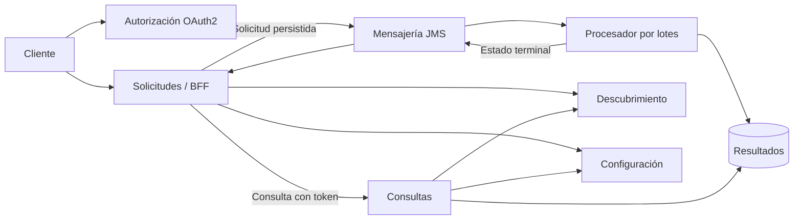

# Propuesta técnica

## Base analizada

El commit inicial contiene una aplicación de procesamiento por lotes, tres trabajos, lectores CSV particionados, procesadores con validación y escritores JDBC. Sus siete pruebas originales verifican transformaciones y resultados persistidos. No incluye endpoints de negocio ni una arquitectura de microservicios.

Se conservan los paquetes existentes, los nombres en español, la inyección por constructor y los comentarios breves que describen una función concreta.

## Cambios

El procesador se amplía con un perfil asíncrono. Los servicios nuevos se organizan en módulos Maven independientes y comparten únicamente la configuración de validación de tokens.

## Correspondencia

| Requisito | Implementación | Comprobación |
|---|---|---|
| OAuth2 | autorización y validación JWT con scopes | emisión, 401, 403 y acceso autorizado |
| Docker | imagen del procesador y una por servicio | construcción y salud |
| Compose | ocho componentes con dependencias y volúmenes | inicio coordinado |
| Resilience4j | circuito, reintentos y respuesta alternativa | caída y recuperación |
| Kafka o JMS | colas persistentes y consumidor transaccional | solicitud y resultado |
| Entregables | código, README, script y evidencia | reproducción local |

## Decisiones

Se utiliza JMS para separar la aceptación de solicitudes de su procesamiento. Una tabla de pendientes permite reintentar publicaciones después de una caída. Los resultados terminales actualizan el estado conservado.

El proceso por lotes identifica cada ejecución mediante el id de la solicitud. Esto impide repetir el trabajo completo cuando una publicación o confirmación se repite. El consumidor se ejecuta con concurrencia uno para respetar las etapas de limpieza existentes.

El servicio de consultas actúa como modelo de lectura sobre las tablas del procesador. Esta base compartida permite continuar el esquema original; una evolución con bases separadas requeriría proyectar los resultados mediante eventos.

El servicio de solicitudes actúa como entrada y agregador de consultas. Propaga el token al servicio de lectura y obtiene sus instancias por descubrimiento. La respuesta alternativa se limita a fallos de disponibilidad; mantiene los errores de autorización y validación.

Los servidores de configuración y descubrimiento se mantienen en una red interna con acceso local de diagnóstico. Los datos, mensajes e informes permanecen en volúmenes.

## Límites

La orquestación incluida es de una sola instancia y permite probar las fallas requeridas. No equivale a alta disponibilidad multizona. El procesador no admite réplicas simultáneas sin coordinación adicional.

Las claves y los clientes de autorización se conservan en memoria durante la ejecución. Un entorno público debe persistir claves y configuración, utilizar HTTPS y administrar secretos fuera del código.
